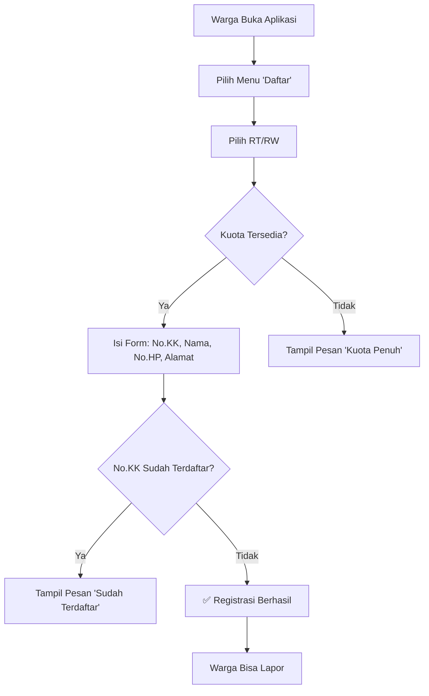
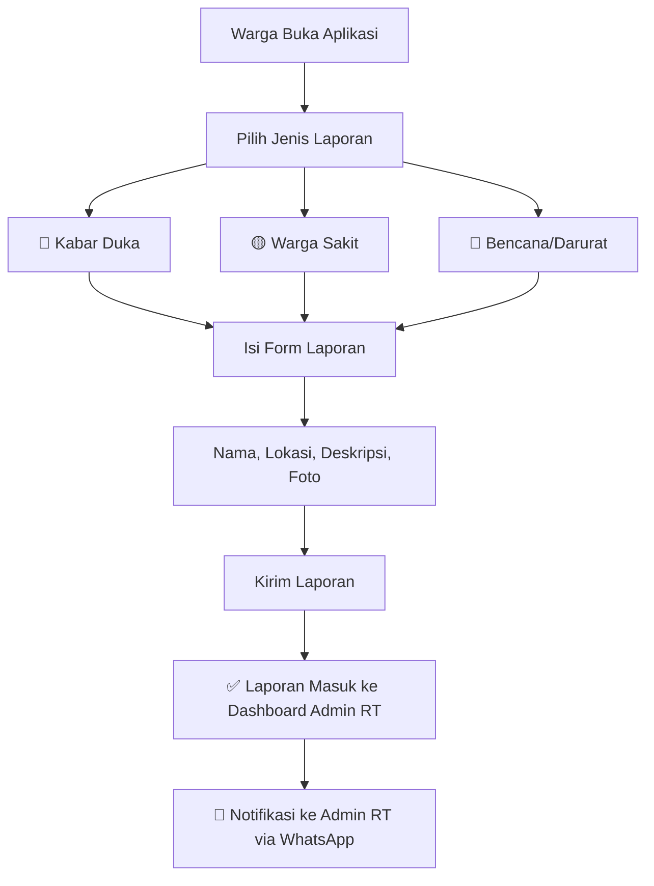
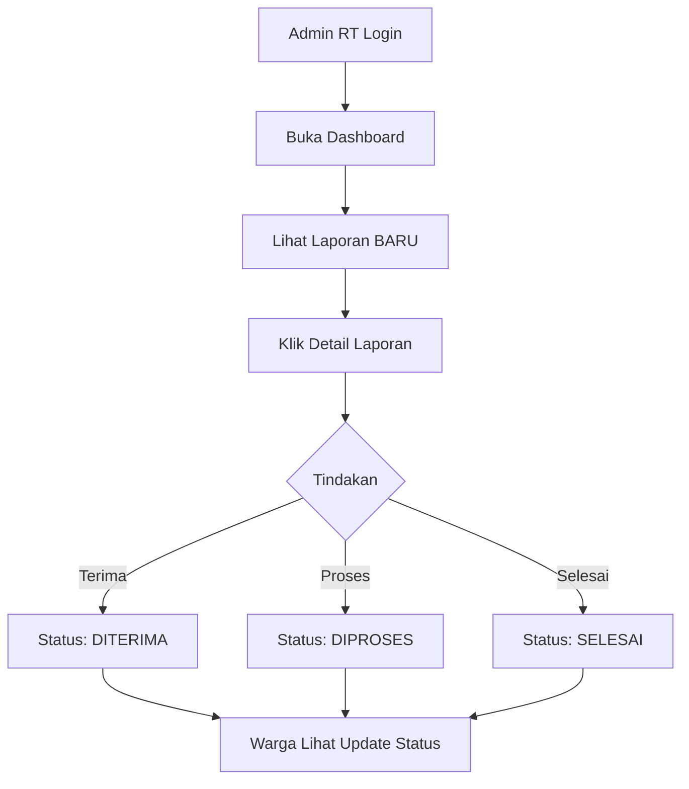
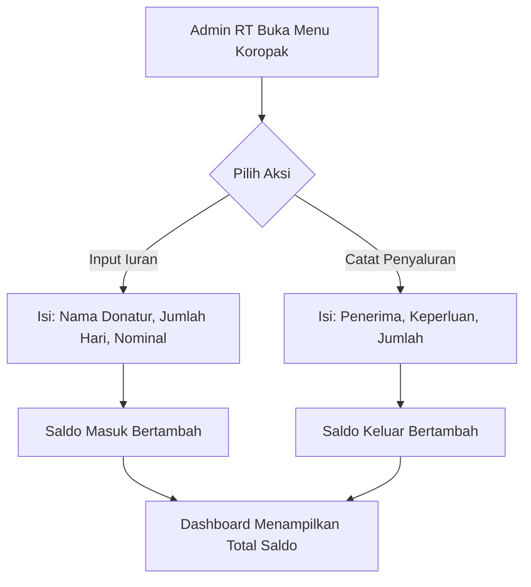
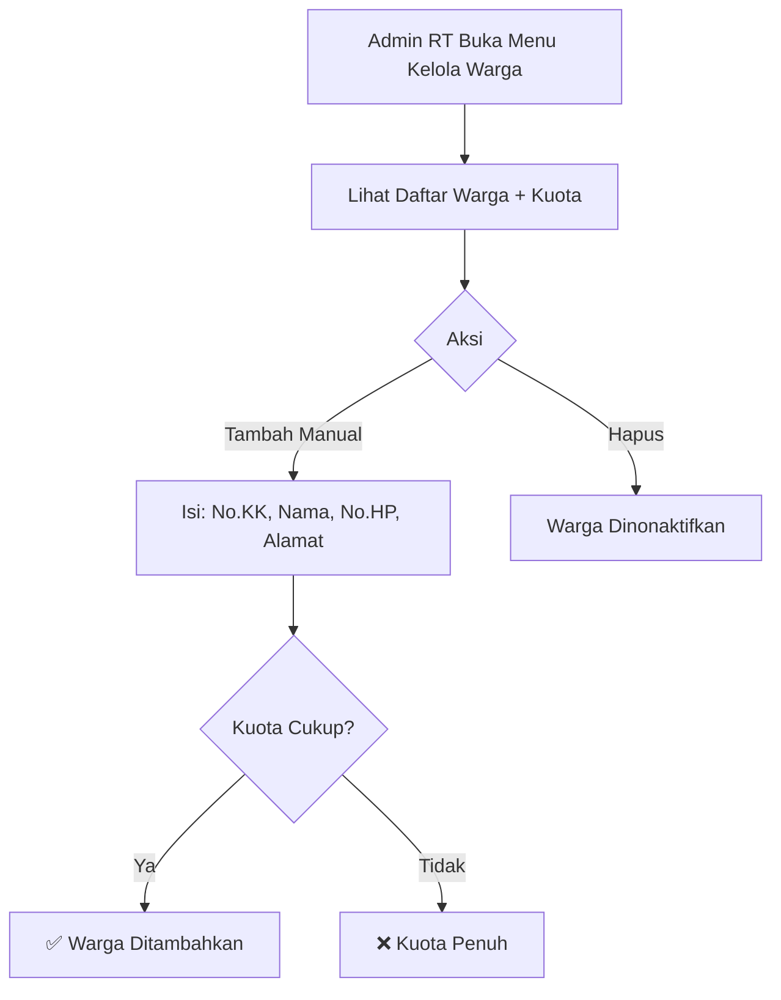
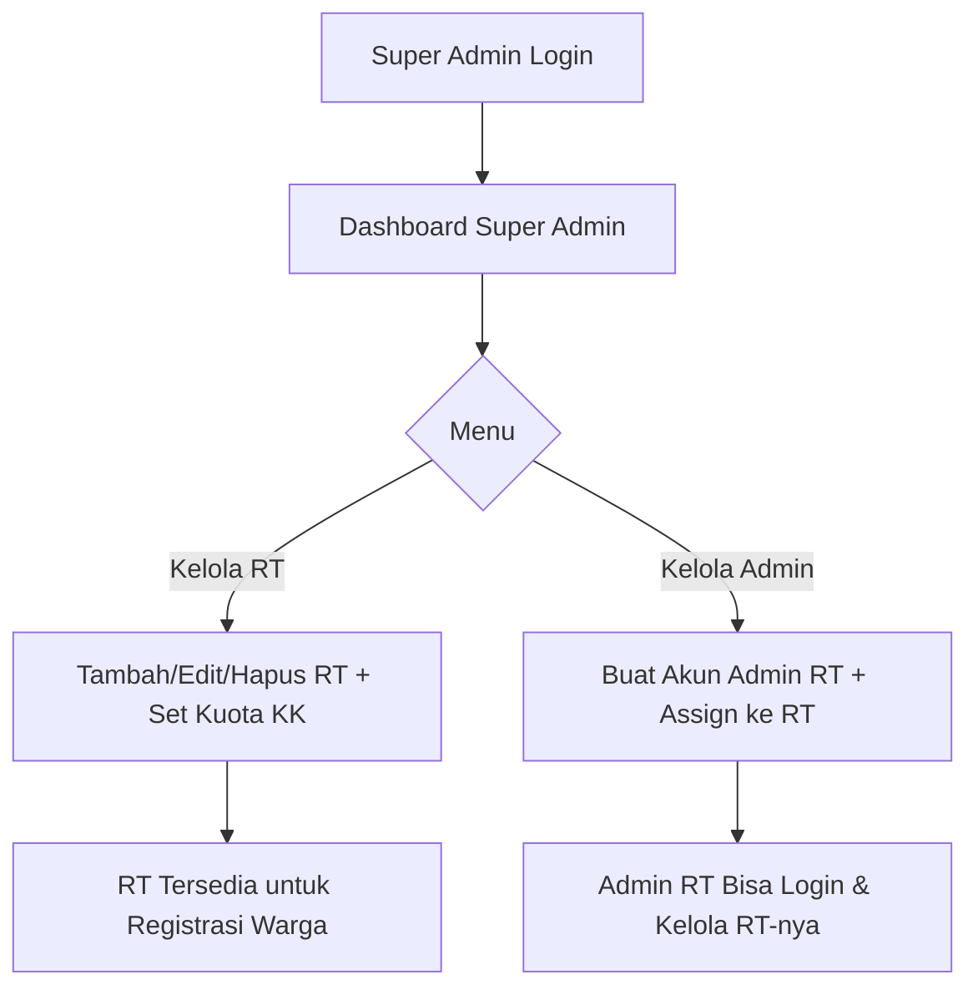

# Proses Bisnis Aplikasi LAPOR RT

## 1. Registrasi Warga



---

## 2. Pelaporan Warga



---

## 3. Penanganan Laporan oleh Admin RT



---

## 4. Pengelolaan Koropak (Dana Sosial)



---

## 5. Pengelolaan Warga Terdaftar



---

## 6. Pengaturan oleh Super Admin



---

## Ringkasan Aktor & Akses

| Aktor | Halaman | Aksi Utama |
|-------|---------|------------|
| **Masyarakat** | `/`, `/daftar`, `/lapor/*` | Daftar warga, Lapor kejadian, Lihat pengumuman |
| **Admin RT** | `/admin/*` | Kelola laporan, Koropak, Warga, Kontak darurat |
| **Super Admin** | `/super-admin/*` | Kelola RT, Kelola Admin |

---

## Alur Lengkap End-to-End

```
┌─────────────────────────────────────────────────────────────────────┐
│                        SUPER ADMIN                                   │
│   1. Buat RT (set kuota warga)                                      │
│   2. Buat akun Admin RT                                             │
└─────────────────────────────────────────────────────────────────────┘
                                ↓
┌─────────────────────────────────────────────────────────────────────┐
│                         ADMIN RT                                     │
│   3. Login ke dashboard                                             │
│   4. Terima & proses laporan warga                                  │
│   5. Kelola koropak, warga, kontak darurat                          │
└─────────────────────────────────────────────────────────────────────┘
                                ↑
┌─────────────────────────────────────────────────────────────────────┐
│                        MASYARAKAT                                    │
│   1. Daftar sebagai warga RT (dengan No.KK)                         │
│   2. Lapor kejadian: Duka, Sakit, Bencana                           │
│   3. Gunakan SOS untuk panggilan darurat                            │
│   4. Lihat status laporan                                           │
└─────────────────────────────────────────────────────────────────────┘
```
