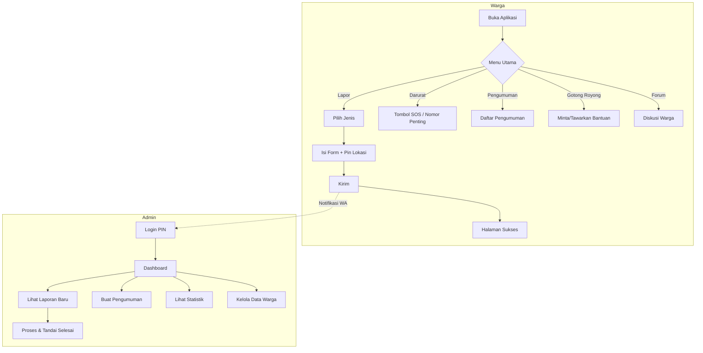

# Konsep Dasar: Aplikasi Lapor RT

## Visi
Aplikasi ringan berbasis web untuk **memudahkan warga melapor kepada RT** dalam situasi penting atau darurat, sekaligus menjadi pusat informasi dan komunikasi warga.

---

## 📱 Platform & Pendekatan Desain

### Target Platform
| Platform | Prioritas | Pengguna |
|----------|-----------|----------|
| **HP (Mobile)** | ⭐⭐⭐ Utama | Warga & Pak RT |
| **Tablet** | ⭐⭐ Sekunder | Pak RT |
| **Laptop/Desktop** | ⭐ Tersier | Pak RT (dashboard) |

### Pendekatan: Mobile-First
> 🎯 **Aplikasi ini didesain UTAMA untuk HP**, baru kemudian responsif ke layar besar.

| Prinsip | Implementasi |
|---------|--------------|
| **Tombol Besar** | Minimal 48px tinggi, mudah ditekan jempol |
| **Teks Jelas** | Minimal 16px, kontras tinggi |
| **Satu Kolom** | Layout vertikal, scroll ke bawah |
| **Gesture Friendly** | Swipe, tap, hold |
| **Offline Support** | PWA agar bisa buka tanpa internet stabil |

### PWA (Progressive Web App)
Aplikasi ini akan dibuat sebagai **PWA** agar:
- ✅ Bisa di-"install" di HP tanpa Play Store/App Store
- ✅ Ada ikon di layar utama HP
- ✅ Push notification seperti app native
- ✅ Bisa buka meski sinyal lemah (cache offline)

---

## Masalah yang Diselesaikan
| Masalah Lama | Solusi Aplikasi |
|--------------|-----------------|
| Warga bingung siapa yang harus dihubungi saat ada kejadian | 1 aplikasi, 3 tombol langsung ke RT |
| Pak RT tidak selalu bisa dihubungi via telepon | Notifikasi otomatis ke WhatsApp + dashboard |
| Informasi tidak tersebar merata ke warga lain | Fitur pengumuman & broadcast |
| Lokasi kejadian sulit dijelaskan via telepon | Peta interaktif dengan pin lokasi |
| Warga tidak tahu status laporan mereka | Fitur tracking status laporan |
| Situasi darurat butuh respons cepat | Tombol SOS + daftar nomor darurat |

---

## Fitur Utama

### 🏠 Sisi Warga (Pelapor)

#### Fitur Inti (Sudah Dibuat)
1. **3 Tombol Darurat**
   - 🔴 **Kabar Duka** – Melaporkan warga meninggal dunia
   - 🟡 **Warga Sakit** – Melaporkan warga butuh bantuan medis
   - 🔵 **Bencana/Darurat** – Banjir, kebakaran, pencurian, dll

2. **Form Pelaporan Simpel**
   - Nama pelapor
   - Lokasi kejadian
   - Deskripsi singkat
   - Foto (opsional)

3. **Tanpa Login Ribet** – Warga tidak perlu daftar akun

#### Fitur Tambahan (Pengembangan)
4. **📍 Peta Lokasi Interaktif** – Pin lokasi kejadian langsung di peta
5. **📜 Riwayat Laporan** – Cek status laporan yang pernah dikirim
6. **📢 Pengumuman RT** – Lihat info penting dari RT
7. **🗓️ Kalender Kegiatan** – Jadwal ronda, kerja bakti, pertemuan

---

### 👨‍💼 Sisi Admin (Pak RT)

#### Fitur Inti (Sudah Dibuat)
1. **Login dengan PIN** – Keamanan sederhana
2. **Dashboard Laporan** – Melihat semua laporan masuk
3. **Status Laporan** – BARU / DIBACA / SELESAI

#### Fitur Tambahan (Pengembangan)
4. **🔔 Notifikasi WhatsApp** – Terima notifikasi otomatis saat ada laporan baru
5. **📊 Statistik Laporan** – Grafik jumlah laporan per kategori/bulan
6. **📣 Broadcast Pengumuman** – Kirim info ke semua warga
7. **📤 Export PDF/Excel** – Cetak rekap laporan untuk arsip
8. **👥 Multi-Admin** – Tambah sekretaris atau wakil RT
9. **📋 Data Warga** – Database sederhana warga per blok/rumah
10. **💰 Rekap Iuran** – Catatan iuran bulanan warga (opsional)

---

### 🔔 Sistem Notifikasi & Respons

#### Penerima Notifikasi Laporan

> **PENTING**: Setiap laporan akan dikirim ke pihak yang relevan sesuai jenis kejadian.

| Role | Jabatan | Menerima Notifikasi |
|------|---------|---------------------|
| **👨‍💼 Ketua RT** | Ketua RT 05 | ✅ Semua laporan |
| **👮 Babinsa** | Bintara Pembina Desa | ✅ Keamanan, Bencana, Kriminal |
| **👮‍♂️ Binmas** | Pembina Masyarakat (Polisi) | ✅ Keamanan, Kriminal, Ketertiban |
| **🚑 Sopir Ambulan** | Sopir Ambulan Desa/Kelurahan | ✅ Warga Sakit, Kabar Duka |
| **🚒 Pemadam Kebakaran** | Damkar Kecamatan | ✅ Kebakaran, Bencana |
| **🏥 Puskesmas** | Petugas Kesehatan | ✅ Warga Sakit |
| **👥 RW** | Ketua RW 03 | ✅ Laporan penting/eskalasi |

#### Matriks Notifikasi per Jenis Laporan

| Jenis Laporan | RT | Babinsa | Binmas | Ambulan | Damkar | Puskesmas |
|---------------|:--:|:-------:|:------:|:-------:|:------:|:---------:|
| **Kabar Duka** | ✅ | ⚪ | ⚪ | ✅ | ⚪ | ⚪ |
| **Warga Sakit** | ✅ | ⚪ | ⚪ | ✅ | ⚪ | ✅ |
| **Kebakaran** | ✅ | ✅ | ⚪ | ✅ | ✅ | ⚪ |
| **Bencana Alam** | ✅ | ✅ | ✅ | ✅ | ✅ | ✅ |
| **Pencurian/Kriminal** | ✅ | ✅ | ✅ | ⚪ | ⚪ | ⚪ |
| **Kecelakaan** | ✅ | ⚪ | ✅ | ✅ | ⚪ | ✅ |
| **SOS Darurat** | ✅ | ✅ | ✅ | ✅ | ✅ | ✅ |

> ✅ = Menerima notifikasi otomatis | ⚪ = Tidak menerima

#### Metode Pengiriman Notifikasi

| Metode | Cara Kerja | Kapan Digunakan |
|--------|------------|-----------------|
| **📱 Push Notification** | Notifikasi HP dengan bunyi khusus | Saat ada laporan apapun |
| **💬 WhatsApp Otomatis** | Pesan WA ke semua penerima terkait | Laporan darurat/penting |
| **📩 SMS Backup** | Jika internet mati, kirim SMS | Kondisi darurat ekstrem |
| **🔊 Alarm Dashboard** | Bunyi sirene di browser dashboard | Admin sedang buka laptop |

#### Alur Notifikasi Multi-Penerima
```
Warga Kirim Laporan (Jenis: Kebakaran)
              ↓
       [Server Terima]
              ↓
    [Tentukan Penerima dari Matriks]
              ↓
   ┌────┬────┬────┬────┐
   ↓    ↓    ↓    ↓    ↓
  RT  Babinsa Ambulan Damkar  Dashboard
   ↓    ↓    ↓    ↓    ↓
  WhatsApp + Push Notification
```

#### Fitur Respons Admin (Semua Penerima Bisa Merespons)

| Fitur | Deskripsi |
|-------|-----------|
| **✅ Tombol "Terima Laporan"** | Klik sekali → Status jadi "DITERIMA" → Warga dapat notifikasi |
| **💬 Balas dengan Pesan** | Tulis pesan singkat (misal: "Tim Damkar sedang menuju lokasi") |
| **📞 Tombol Hubungi Pelapor** | Langsung telepon/WA ke pelapor |
| **🔄 Update Status** | BARU → DITERIMA → DIPROSES → SELESAI |
| **👥 Koordinasi Antar Responder** | Chat grup internal untuk koordinasi penanganan |

#### Status Laporan (Lengkap)
| Status | Warna | Arti |
|--------|-------|------|
| 🔴 **BARU** | Merah | Belum ada responder yang merespons |
| 🟡 **DITERIMA** | Kuning | Minimal 1 responder sudah menerima |
| 🔵 **DIPROSES** | Biru | Sedang ditangani di lapangan |
| 🟢 **SELESAI** | Hijau | Sudah selesai ditangani |

---

### 🚨 Fitur Keamanan & Darurat

| Fitur | Deskripsi |
|-------|-----------|
| **🆘 Tombol SOS** | Satu klik langsung kirim lokasi + notifikasi darurat ke RT + tetangga terdekat |
| **📞 Nomor Darurat Lengkap** | Daftar kontak penting: ambulans, pemadam, polisi, PLN, PDAM |
| **🏃 Mode Evakuasi** | Peta titik kumpul saat bencana + jalur evakuasi |

---

### 🤝 Fitur Sosial & Komunitas

| Fitur | Deskripsi |
|-------|-----------|
| **🙋 Gotong Royong Digital** | Warga bisa minta/tawarkan bantuan (jemput anak, antar belanja lansia) |
| **💬 Forum Diskusi** | Warga bisa diskusi masalah umum (parkir liar, sampah, dll) |

---

### ♻️ Bank Sampah

> **Pengelola**: Satu warga yang ditunjuk sebagai pengelola Bank Sampah RT

#### Untuk Warga
| Fitur | Deskripsi |
|-------|-----------|
| **📋 Info Bank Sampah** | Lihat jenis sampah yang diterima & harga/poin |
| **🚛 Request Jemput Sampah** | Minta sampah dijemput ke rumah |
| **💰 Saldo Poin/Uang** | Lihat poin terkumpul dari sampah |
| **🔄 Tukar Poin** | Tukar poin jadi uang tunai atau voucher |

#### Untuk Pengelola Bank Sampah
| Fitur | Deskripsi |
|-------|-----------|
| **📥 Daftar Request Jemput** | Lihat permintaan jemput dari warga |
| **✅ Konfirmasi Jemput** | Tandai sudah dijemput |
| **⚖️ Input Berat & Hitung Poin** | Timbang sampah, otomatis hitung poin |
| **📊 Rekap Transaksi** | Laporan harian/bulanan |

#### Jenis Sampah & Harga (Contoh)
| Jenis Sampah | Harga per Kg | Poin |
|--------------|--------------|------|
| Plastik Bersih | Rp 2.000 | 20 |
| Kertas/Kardus | Rp 1.500 | 15 |
| Logam/Kaleng | Rp 5.000 | 50 |
| Botol Kaca | Rp 500 | 5 |

---

### 🏛️ Integrasi Eksternal

| Fitur | Deskripsi |
|-------|-----------|
| **📤 Sinkron ke Kelurahan** | Laporan penting bisa diteruskan ke kelurahan |

---

### ♿ Aksesibilitas

| Fitur | Deskripsi |
|-------|-----------|
| **🔊 Voice Input** | Lansia bisa lapor dengan suara |
| **🔠 Mode Teks Besar** | Tombol khusus untuk perbesar font |
| **🌙 Mode Gelap** | Nyaman dipakai malam hari |
| **🌐 Multi Bahasa** | Untuk kompleks dengan warga asing |

---

## Tech Stack
| Komponen | Teknologi | Status |
|----------|-----------|--------|
| Framework | Next.js 16 (App Router) | ✅ Terpasang |
| Styling | Tailwind CSS v4 | ✅ Terpasang |
| Icons | Lucide React | ✅ Terpasang |
| Font | Outfit (Google Fonts) | ✅ Terpasang |
| Database | Supabase | ⏳ Belum |
| Maps | Leaflet / Google Maps | ⏳ Belum |
| Notifikasi | WhatsApp API / Fonnte | ⏳ Belum |
| PWA | next-pwa | ⏳ Belum |

---

## Struktur Folder
```
app/
├── page.tsx              # Homepage (3 tombol)
├── layout.tsx            # Layout global + font
├── globals.css           # Tailwind import
├── admin/
│   ├── page.tsx          # Dashboard Pak RT
│   ├── pengumuman/       # Kelola pengumuman
│   ├── warga/            # Data warga
│   └── statistik/        # Grafik laporan
├── lapor/
│   ├── [jenis]/page.tsx  # Form laporan dinamis
│   ├── sukses/page.tsx   # Konfirmasi sukses
│   └── riwayat/          # Riwayat laporan warga
├── darurat/              # Nomor darurat + SOS
├── pengumuman/           # Lihat pengumuman
├── kegiatan/             # Kalender kegiatan
├── gotong-royong/        # Minta/tawarkan bantuan
└── forum/                # Diskusi warga
```

---

## Alur Pengguna



---

## Roadmap Pengembangan

### Fase 1: MVP ✅
- [x] Homepage dengan 3 tombol darurat
- [x] Form laporan dinamis
- [x] Halaman sukses
- [x] Dashboard admin dengan login PIN
- [x] Daftar laporan dengan status

### Fase 2: Backend & Data
- [ ] Integrasi Supabase (database)
- [ ] Penyimpanan foto ke cloud
- [ ] Notifikasi WhatsApp ke Pak RT

### Fase 3: Fitur Darurat & Lokasi
- [ ] Tombol SOS
- [ ] Daftar nomor darurat lengkap
- [ ] Peta lokasi interaktif
- [ ] Mode evakuasi & titik kumpul

### Fase 4: Fitur Komunitas
- [ ] Riwayat laporan untuk warga
- [ ] Pengumuman & broadcast
- [ ] Gotong royong digital
- [ ] Forum diskusi warga
- [ ] Sinkronisasi ke kelurahan

### Fase 5: Aksesibilitas & Polish
- [ ] PWA (install di HP)
- [ ] Voice input untuk lansia
- [ ] Mode teks besar
- [ ] Mode gelap
- [ ] Multi bahasa

---

## Catatan Penting
> **Target Pengguna**: Warga dari berbagai usia termasuk lansia.  
> Desain harus **simpel, tombol besar, teks jelas**.
